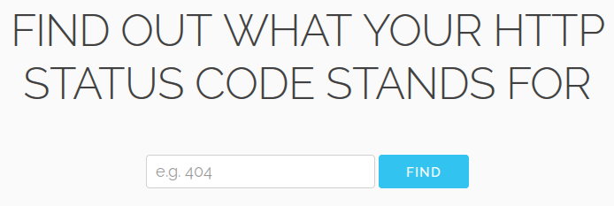

# httpstatusco.de

[httpstatusco.de](http://www.httpstatusco.de) is a super simple way to figure out what a specific HTTP status code means.

Don't remember what a `415` was again? httpstatusco.de is there for you. Simply go to [httpstatusco.de/415](www.httpstatusco.de/415) and be enlightened.

## HTTP Status Code Lookup
There are a couple of ways you can use [httpstatusco.de](http://www.httpstatusco.de)to lookup your status codes.

### Using the site search
To lookup your desired status code you can simply go to [httpstatusco.de](http://www.httpstatusco.de) and enter your status code.

### Enter the direct URL
The URLs follow a simple and readable schema. You can point your browser to `httpstatusco.de/<yourCode>` and you're good to go.

### Use a Chrome Custom Search
If you're a Chrome/Chromium user you can also register a custom search for easy access:

  1. Go to your [Browser Settings](chrome://settings/)
  2. Click on "_Manage search engines..._" in the _search_ section
  3. Add a new search engine:  
  **Keyword**: http  
  **URL**: `http://www.httpstatusco.de/%s`

Now you can type `http` in your omnibar, hit `Tab` and enter your status code

## Bugs and Feature Requests
If you find any bugs or have feature requests feel free to open a Github Issue or send me a pull request.

## Development
This application is built using Python 3.5 and Flask.

Following steps will help you getting started with development:
  1. Clone this Repository
  2. Make sure you have Python 3.5 installed on your system (I recommend [virtualenv](https://virtualenv.pypa.io/en/latest/))
  3. Install dependencies: `pip install -r requirements.txt`
  4. Run tests: `python test.py`
